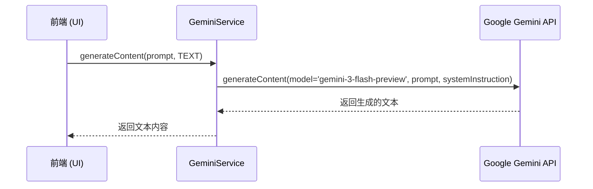
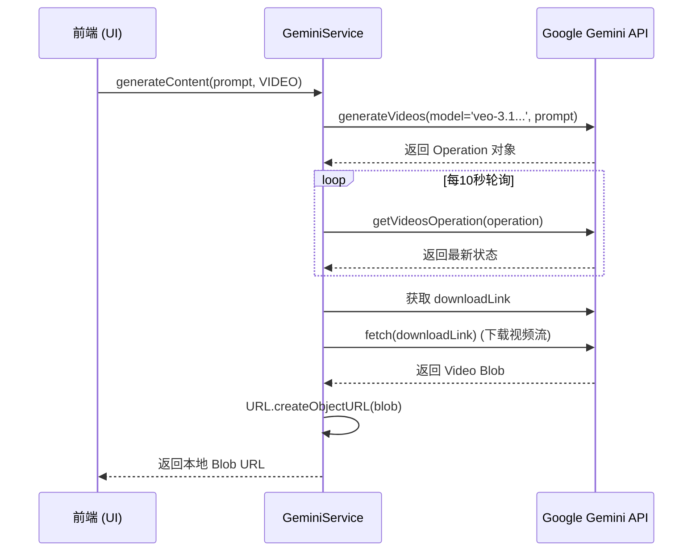
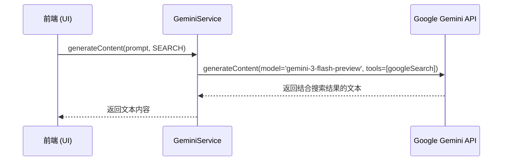

# 后端生成逻辑业务流程图

本项目后端生成逻辑主要集成在 `services/geminiService.ts` 中，使用 Google Gemini API 进行多模态内容生成。

## 1. 文字生成 (Text Generation)

- **模型**: `gemini-3-flash-preview`
- **逻辑**: 发送 Prompt，附带系统指令 ("You are a world-class e-commerce copywriter...")。



## 2. 图片生成 (Image Generation)

- **模型**: `gemini-2.5-flash-image`
- **配置**: 16:9 宽高比
- **逻辑**: 请求生成图片，解析返回的 base64 数据。

```mermaid
sequenceDiagram
    participant Frontend as 前端 (UI)
    participant Service as GeminiService
    participant API as Google Gemini API

    Frontend->>Service: generateContent(prompt, IMAGE)
    Service->>API: generateContent(model='gemini-2.5-flash-image', prompt)
    API-->>Service: 返回包含 inlineData (Base64) 的响应
    Service->>Service: 拼接 "data:image/png;base64,..."
    Service-->>Frontend: 返回 Base64 图片 URL
```

## 3. 视频生成 (Video Generation)

- **模型**: `veo-3.1-fast-generate-preview`
- **逻辑**: 异步生成，需要轮询操作状态，完成后下载视频 Blob。



## 4. 搜索/市场洞察 (Search Insight)

- **模型**: `gemini-3-flash-preview`
- **工具**: `googleSearch`
- **逻辑**: 使用 Google Search Tool 增强回答。


